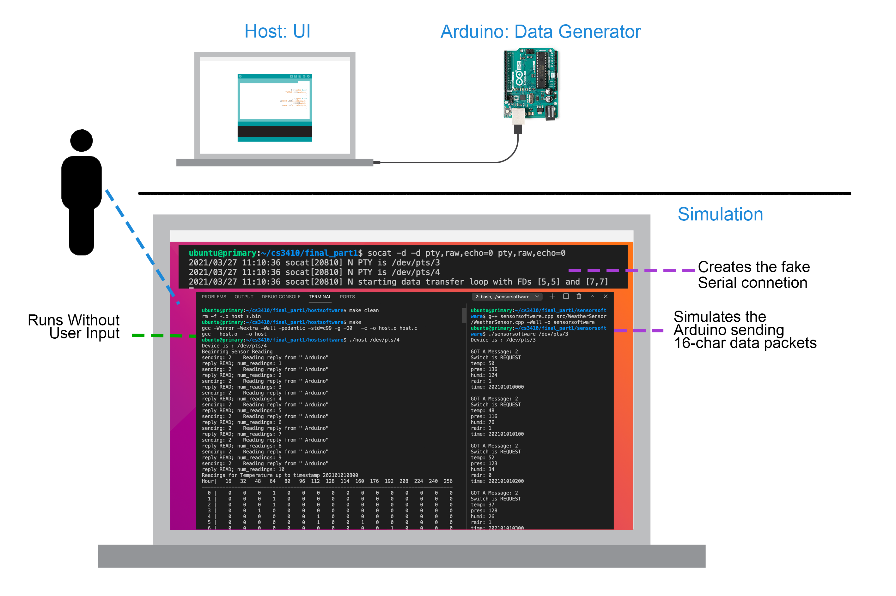

# Project: Simulated Weather Analyzer

**Due Date:** Thursday April 15th, 2021 at 11:59 PM

You may work in teams of *up to* **three (3)** members from your lab section (The tteams were assigned by email)

## Background Information

Last part you focused on the communication between the (fake) Arduino and the host (actually a guest Ubuntu). With the Arduino providing several functionalities depending on what option was chosen by a user from a set of options exposed by the host c code.

For this part, we will refine the implementation to simulate the sensing of a set of weather-related data, and its processing in the host machine. 

**Note that in this part, once we initialize the host-side code, we will not require any user interaction.** This means that the host will read data from the fake Arduino without requiring the user to tell it to "get" the information.

#### Storing the information (The Histograms):

One eventual goal of this project is to detect when sensor readings are outliers and to be able to perform a whole lot of data analysis. We will accomplish this by using histograms of (fake) Arduino readings which we'll store in memory on the host machine. 

The weather data will consist of data blocks with *temperature*, *pressure*, *humidity*, a *rain indicator* (whether it rained or not), and a *time stamp*. We will call this information, the **data packet**.

We know that temperature, pressure, and humidity are different at different times of day. Usually, the temperature will be lower during the night than it will be during the day. Therefore, we will actually store a separate histogram for different parts of the day, in order to more accurately compare temperature readings. We will construct these *whole-day histograms* for temperature, pressure, and humidity. We will also keep a record of all sensor readings that arrive from the Arduino. 

Note that since we want to cover a large interval of time (at least three-days worth) we will be interpreting each packet that arrives from the Arduino (once each second) as the **sensor readings for a whole hour**. This means that in 24 seconds of packets we will cover a day of readings, and in 72 seconds, we will have the required 3 days of data.

The structure for each *whole-day histogram* is like a grid. Imagine a two dimensional array: one axis (y) is separated into 1-hour time increments (based on the time of day when the reading was taken) and the other axis (x) contains "buckets" of possible sensor readings. When a new reading is processed, we find where the proper time "bucket" intersects with the correct sensor value "bucket". Increment a counter at this position in the 2D array.

One additional consideration is that we want the data stored to be persistent - it should not be lost when the host program stops running. This requirement precludes the use of `malloc`/`free` like we have done in the past. Instead, we will use a function called `mmap` to load the contents of a file into our program's virtual memory space. Use the `open` function to obtain a file descriptor for the backing file and pass the result to `mmap` to load it into memory. Be sure to use `munmap` and `close` on the mapping and file descriptor, respectively. For more information, run `man 2 mmap` on any UNIX system.

For this part, we will be focusing on the storage aspect of this process. We will leave the data analysis and "visualizations" for the next part. 

### Specification (for Part 1)

In this part, we will focus on building one layer of data storage on the host machine and the communication protocol to and from the Arduino. Your program should perform the following:

 - Run the provided fake Arduino code (with included libraries) so that it sends the simulated weather data. Note that we modified the basic functionality of the Arduino to make it easier to use.
 - Build the histogram structures (one for temperature, one for pressure, and one for humidity) described above into an `mmap`'d file. They should be called "tmp_hist.bin", "prs_hist.bin", and "hmd_hist.bin".
 - The host program should request a data packet from the Arduino every second or so. The Arduino will send the data according to a predefined structure, which is indicated in the host-side code (see the comment about the format in the `main_loop` method). The information received should be parsed to extract the temperature, pressure, and humidity values, as well as the time of day. This will allow you to increment the correct counter in each of the histograms. In addition, a comma-separated sequence with the three values and time-stamp should be stored in a binary file called "record.bin".
 - Every 10 seconds, the host program should print out a graphical representation of the histogram structures (three 2D grids).

### Execution Instructions

You will run the `make` command in the hostsoftware folder to compile that set of files. Once the hostsoftware compiles, you will perform the following setup and execution:

Execution (starting from scratch):

  1. Open one terminal (t1), and make the socat fake serial ports (it does not matter from which directory):
      1. in terminal 1 \[t1\], run: 
          `socat -d -d pty,raw,echo=0 pty,raw,echo=0`
  2. Note the pair of pseudoterminals that are printed:
      1. (example):
          `/dev/pts/3`
          `/dev/pts/4`     
  3. Open another pair of terminals, one for the sensorsoftware (t2) and one for the hostsoftware (t3). 
  4. Compilation instructions for the fake Arduino's sensorsoftware in \[t2\]:
      1. `cd` into the sensorsoftware folder
      2. run, in \[t2\]:
          `g++ sensorsoftware.cpp src/WeatherSensor/WeatherSensor.cpp -Wall -o sensorsoftware`
  5. Compilation instructions for the hostsoftware in \[t3\]: 
      1. `cd` into the hostsoftware folder
      2. run, in \[t3\]:  
          `make`
  6. Run the sensor software with one of the ends of the pseudo-terminals as a parameter:
      1. run, in \[t2\]:
          `./sensorsoftware /dev/pts/3`
  7. Run the host software with the other pseudo-terminal as a parameter:
      1. run, in \[t3\]:
          `./host /dev/pts/4`
  8. Wait until termination (~72 seconds)

#### Notes on stopping and restarting

If manually stopping (Ctrl+C), you should always stop the hostsoftware first and then the sensorsoftware. 

If the hostsoftware is stopped after the sensorsoftware, there might be an unconsummed byte in the serial buffer. In that case, simply run the sensorsoftware first, and if it gets a message, simply stop it and run everything again.

Also, if you are testing the full run, you need to reset the bacckup files for the histograms. To do so, simply run `make clean` and then `make`  on the hostsoftware terminal \[t3\].

### Other Tips and Tricks

 - Really think about the communication protocol. Read the comments to get a clear idea of what is going on. Look for design aspects that focus on making the system reliable, correct, **and** robust. This is difficult to do, especially when you are processing messages longer than one byte (which you must do here). For clarity, sketch out the different messages, possibly separated into requests and responses.
 - Additional tips or clarifications might get posted later, depending on the questions you ask in office hours. You should still start before that time, however, since you should still attempt to complete this part by yourself first. If you wait until then to start, you will find you won't have much time and much misery will follow.
 - Since the histogram is stored in a `mmap`'d file, you should be able to open it and see its raw bytes in any text editor. This may be useful for debugging purposes.
 - You may notice that the command line interface from part 1 is not required here, although many other parts are.

#### Deliverables and Grading

 - A new individual assignment will be provided in GitHub Classroom. The provided template has two main parts: a folder named `sensorsoftware` and one named `hostsoftware`. For this part, **you do not need to change anything in the `sensorsoftware` side**. You will do well to look inside and study how everything is done, but you do not need to change anything on the Arduino side. It is especially important to check out how we moved some of the computation to the methods exposed in `WeatherSensor.h`.
 - All your work will happen on the host side. We have split the old host-side c code into parts that specialize in different functions. Inside the folder called `hostsoftware` you'll find the following files:

    - host.c: \[You do not need to change anything in here but you should still study it.\] This file contains the main for the host side, as well as the main_loop, where all other methods are called. Note that the `main_loop` contains the code `while (num_readings < 3 * 24)` that stops execution after three-days of sensor readings (in 72 seconds). 
    - arduinocom.h: \[You do not need to change anything in here but you should still study it.\] library with the serial communications. 
    - **hist.h**:\[You must complete this code.\] manages the code for constructing, updating, printing and deconstructing the histograms. 
    - **record.h**:\[You must complete this code.\] manages the code for constructing, updating, and deconstructing the record of sensor packets. 
    - Makefile: \[You do not need to change anything in here but you should still study it.\] Allows you to run `make` in the `hostsoftware` folder to create all required files. 
    - **record.solution**: contains the final state that you should get in the record.bin file at the end of the execution.
     - **stdout.solution**: contains the final printout that you should get in the terminal at the end of the execution. You can also open the histograms and compare the resulting states to the last three printed histograms in this file.
 - Be sure to write clear and concise commit messages outlining what has been done.
 - Write clean and simple code, using comments to explain what is not intuitive. If the grader cannot understand your code, you will lose credit on the assignment.
 - Be sure your code compiles! If your code does not compile, you will receive **no credit**. It is better to submit a working program that only does a subset of the requirements than a broken one that attempts to do them all.
 - You must create a **one page Write-Up** explaining how the protocol works in a way that is easily followed by a casual reader. You may use state-diagrams or flowcharts to illustrate the steps followed.

| Category                                   | Percentage |
|:------------------------------------------:|:----------:|
| Demo (works perfectly)                     | 80%        |
| Code Quality                               | 10%        |
| Write-Up                                   | 10%        |

Table: Grading Rubric

### System Diagram

